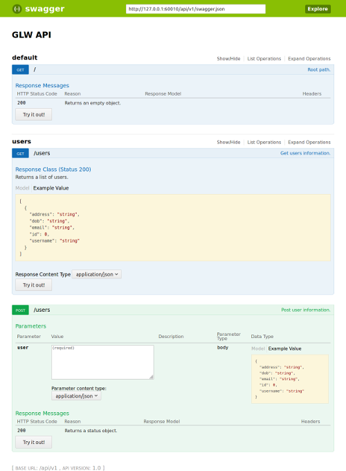
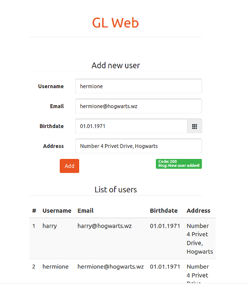

# GLW
GLW is a simple web app with a minimal front-end and API, only for educational
purposes. It is purposefully vulnerable to some attacks, written in Python.

## Getting Started
These instructions will get you a copy of the package up and running on your
local machine.

### Local Installation and Running
Get code and install with:
```bash
git clone git@github.com:goncalo-godwitlabs/glw.git && cd glw/
make install
pipenv shell  # ensure the environment is activated for the following commands as well
```

Optionally, for debugging purposes it may be useful to run a simple log server
which listens to UDP log messages sent by the other services:
```bash
make run-log-server
```

Then run the API:
```bash
make run-api
```

And the UI:
```bash
make run-ui
```

And finally run the tests:
```bash
make test
```

### Running with docker-compose
To run with docker-compose just run:

```bash
make docker-compose-build
make docker-compose-up
```

which builds the containers, runs the app and eventually returns after running
the tests. A report is then generated.

### Tests report
After running the tests an HTML report is generated. When the tests are run
locally the report is written to `report/index.html`. When run with
docker-compose the report is written to `compose/app/data/report/index.html`.

## API
The API exposes a single resource: `users`. And accepts two methods only, a GET
which retrieves the list of users, and a POST to submit a new single user.
For more information point the browser to the api documentation url: http://127.0.0.1:60010/api/v1/ui/.



## Frontend
The app has a minimal frontend with a header, two subheaders, input text fields for the new user:  username, email, dob and address, a submit button, a notification area for feedback and a table with the list of submitted users.



## Testing Approach
The tests are mostly focused on functionality, but there are a couple of tests on load testing and security as well. In the main `conftest.py` it is shown how to add support to other browsers without changing the tests implementation, just by setting the the pytest `--driver {Chrome,Firefox,etc}` flag. However, and for the sake of simplicity, tests only support the Chrome browser/driver for now.


## License
This project is licensed under the MIT License - see the [LICENSE.md](LICENSE.md) file for details.
